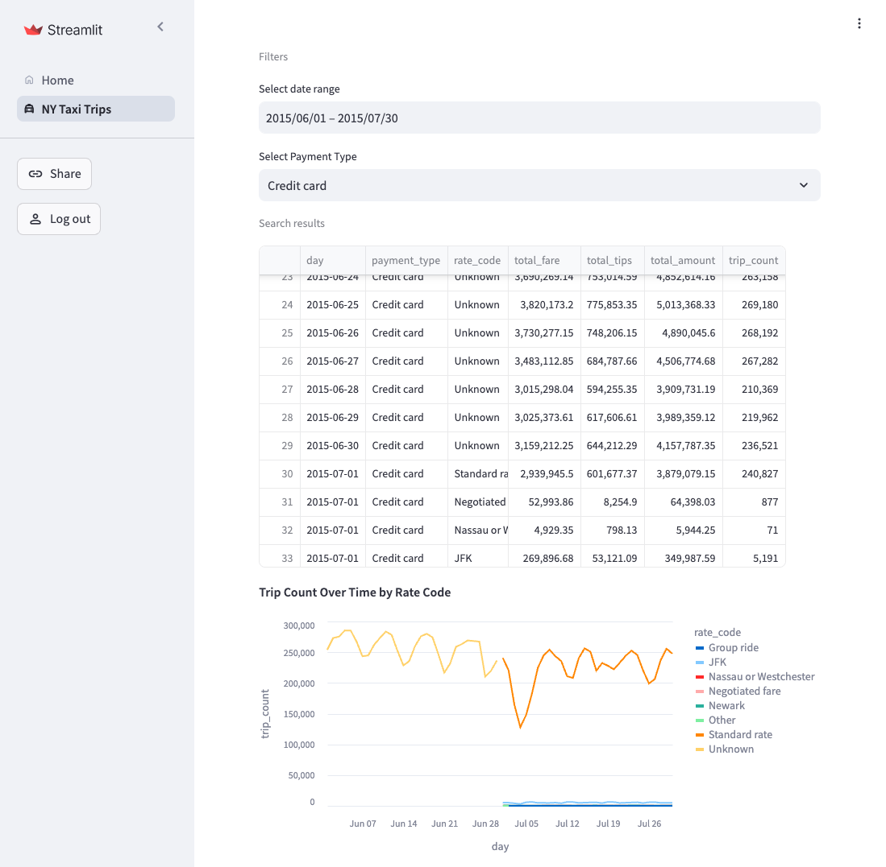

# Streamlit Non-Trivial Application Skeleton

[](https://github.com/mkuthan/example-streamlit/actions/workflows/ci.yml)
[](https://codecov.io/gh/mkuthan/example-streamlit)

This project demonstrates how to leverage the built-in power of Streamlit using best software engineering practices and tools. It provides a non-trivial Streamlit application skeleton, showcasing how to effectively utilize Streamlit's capabilities and address its limitations.



## Key Features and Benefits

### Architecture & Build

* 🏗️ Modular, layered architecture for better maintainability
* 🧩 Separation of concerns for improved testability
* ⚙️ Modern build tools to complete full CI builds in under 30 seconds
* 🧹 Automated formatter and linter
* 📊 Test coverage
* 🐞 Test execution and debugging available directly from VS Code
* 📦 Minimal number of external dependencies
* 🐳 Optimized Docker image for deploying application

### Streamlit Features

* 🌐 Web routing using built-in multi-page navigation capabilities
* 🔄 Sample reusable, stateful components
* ✅ All pages and components tested with `AppTest`
* 📊 Vega-Altair example visualization
* 🗂️ BigQuery integration using the New York Taxi public dataset
* 🔒 Authentication skeleton, easily replaceable with OAuth
* 🔗 Application state sharing via URL
* 💾 Dataframe export buttons to CSV and XLS

### TODO

* 🧪 Implement BigQuery integration tests
* 📈 Add more visualizations for integrated public dataset
* 🔐 Integration with external OAuth provider, see [roadmap](https://roadmap.streamlit.app/)
* 📝 Add request logging
* 🔄 Redirect to the original page after login
* ⚖️ Describe load balancer strategies, for example: sticky session
* 🔄 Automatically update dependencies, see [dependabot#10039](https://github.com/dependabot/dependabot-core/issues/10039)
* 📝 Add more sophisticated type checking, see [mypy](https://mypy.readthedocs.io/)

## Modules

### `example.ui.pages`

* Application pages, no application logic
* Tested with Streamlit testing framework and mocked service layer
* Delegate shared UI components to `example.ui.components`
* Delegate application logic to `example.service`

### `example.ui.components`

* Shared UI components
* Tested with Streamlit testing framework with small helper function wrappers
* Encapsulates Streamlit state management

### `example.services`

* Service layer for application logic
* Tested with Pytest and mocked repositories layer
* Shouldn't import Streamlit API besides `@st.cache`

### `example.repositories`

* Repository layer for data persistence
* Tested in realistic environment (Cloud, Test Containers, etc.)
* Shouldn't import Streamlit API
* Keep it simple, delegate logic to `example.service` if possible

### `example.infrastructure`

* Infrastructure code
* Tested in realistic environment (Cloud, Test Containers, etc.)
* Shouldn't import Streamlit API
* Keep it simple, should not have any application specific logic
* Acts as anti-corruption layer, for example - expose Pandas DataFrame instead of underlying database API

### `example.utils`

* Utility functions
* Tested within Pytest without mocks
* Shouldn't import Streamlit API

## Local development

> [!NOTE]
> You need Google Cloud Platform account to access sample dataset!

Use VS Code with the following extensions:

* Python
* Ruff

Update environment:

```shell
uv sync
```

Execute the following commands to run the application locally:

```shell
streamlit run app.py
```

Check formatting:

```shell
ruff check
```

Execute tests with coverage:

```shell
pytest
```

Show outdated dependencies:

```shell
uv pip list --outdated
```
